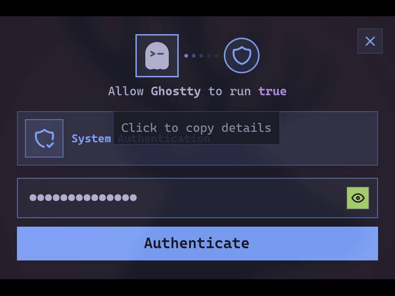
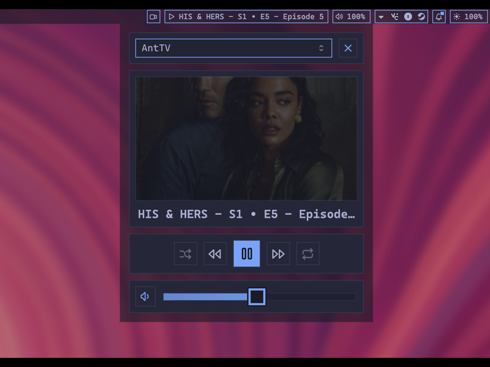
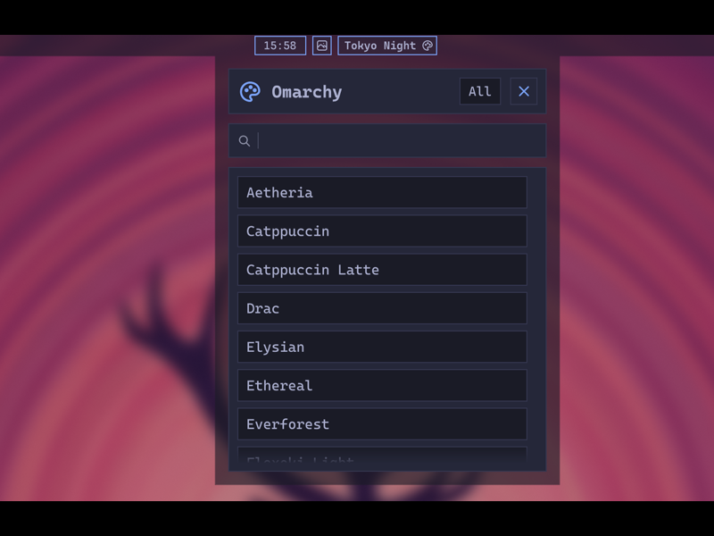
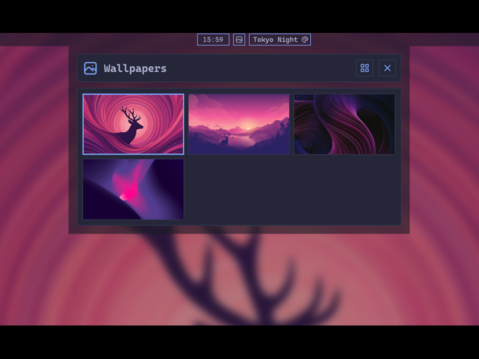

# Bibe Plugins

A small collection of plugins and tooling for Noctalia Shell.

## Installation

Plugins are installed through the Noctalia plugin UI:

1. Open `Settings -> Plugins -> Sources`
2. Click `Add custom repository`
3. Add: `https://github.com/anthonyhab/noctalia-plugins/`

## Repo contents

### BB Auth

[](bb-auth/README.md)

[BB Auth](bb-auth/README.md) — Use Noctalia as your Polkit authentication agent. Supports authentication requests from apps, keyring unlock, and GPG pinentry with automatic fallback UI when the agent is unavailable.

---

### Home Assistant

[](homeassistant/README.md)

[Home Assistant](homeassistant/README.md) — Control Home Assistant media players from Noctalia Shell.

---

### Omarchy Integration

[](omarchy/README.md)

[Omarchy Integration](omarchy/README.md) — Sync Noctalia colors from Omarchy themes.

---

### SWWW Wallpaper Picker

[](swww-picker/README.md)

[SWWW Wallpaper Picker](swww-picker/README.md) — Wallpaper management using `swww`.

---

### Workspace Overview

[](workspace-overview/README.md)

[Workspace Overview](workspace-overview/README.md) — Visual workspace overview with live window previews, drag-and-drop, and keyboard navigation for Hyprland. Supports special/scratchpad workspaces.

Forked from [quickshell-overview](https://github.com/Shanu-Kumawat/quickshell-overview) by [Shanu-Kumawat](https://github.com/Shanu-Kumawat).

---

### waybar-converter

Utility to help convert Waybar configs/themes into Noctalia compatible plugin.

## Validation

Run repository checks before committing:

```bash
./scripts/validate-plugins.sh
```
