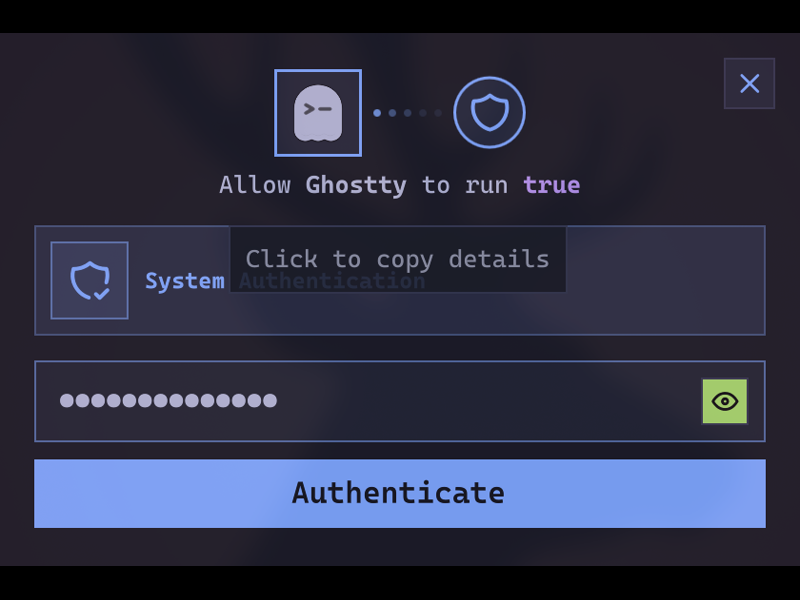
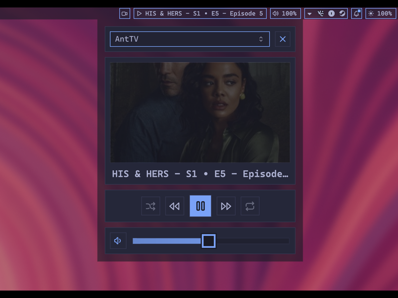
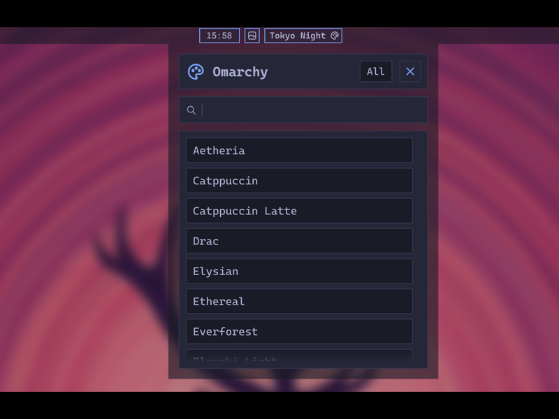
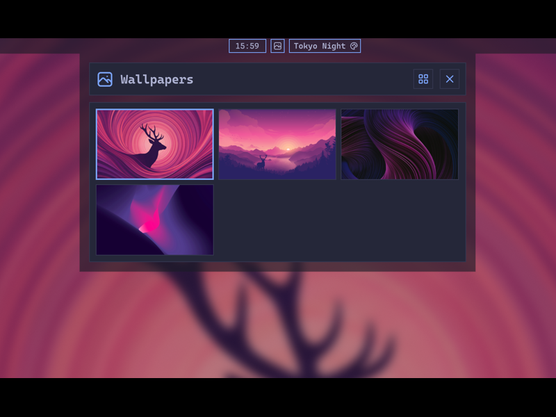
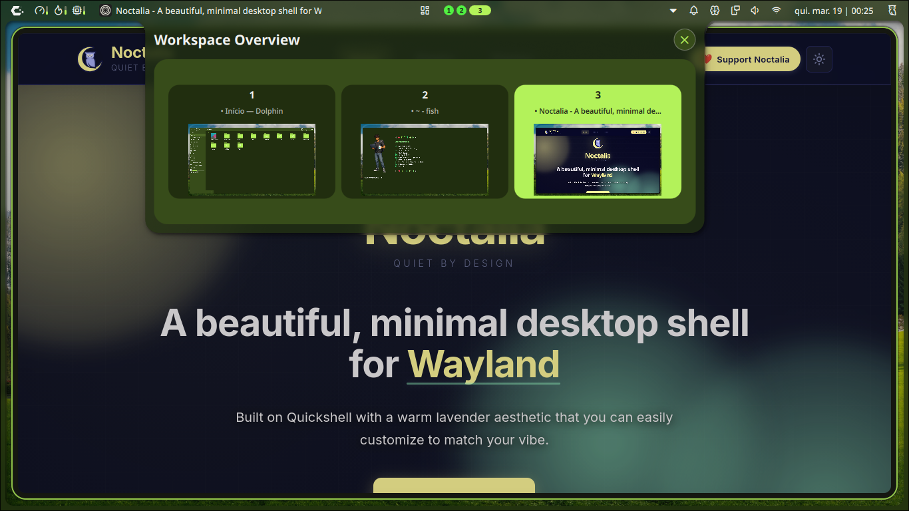

# Noctalia Plugins

Curated plugins for [Noctalia Shell](https://github.com/noctalia-dev/noctalia-shell) on Hyprland and Wayland. Built and maintained by habibe.

This repo focuses on stable, installable plugins with polished bar widgets, panels, and shell integrations.

## Install

Add this repo in the Noctalia plugin UI:

1. Open `Settings -> Plugins -> Sources`
2. Click `Add custom repository`
3. Add `https://github.com/anthonyhab/noctalia-plugins/`

## Stable Plugins

### BB Auth

[BB Auth](bb-auth/README.md) turns Noctalia into a Polkit authentication agent with keyring unlock, GPG pinentry support, and automatic fallback UI when the shell is unavailable. Requires the companion [bb-auth](https://github.com/anthonyhab/bb-auth) daemon.

---

### Home Assistant

[Home Assistant](homeassistant/README.md) adds Home Assistant media controls to Noctalia with a compact bar widget, a richer panel UI, seek and volume controls, and optional default-player selection.

---

### Omarchy Integration

[Omarchy Integration](omarchy/README.md) syncs Noctalia colors from Omarchy themes and ships precomputed CIELAB-tuned palettes for fast, consistent theme changes.

---

### SWWW Wallpaper Picker

[SWWW Wallpaper Picker](swww-picker/README.md) manages wallpapers through `swww` with next/previous/random actions, auto-rotation, shuffle, history, and configurable transitions.

---

### Hypr Overview

[Hypr Overview](hypr-overview/README.md) gives Hyprland a live workspace overview with previews, drag-and-drop window moves, keyboard navigation, and an optional Noctalia bar widget. Adapted from [quickshell-overview](https://github.com/Shanu-Kumawat/quickshell-overview) by [Shanu-Kumawat](https://github.com/Shanu-Kumawat).

## Utilities

- [Waybar to Noctalia Converter](waybar-converter/README.md) converts Waybar custom modules into Noctalia widget configs or starter plugin scaffolds.

## License

MIT
