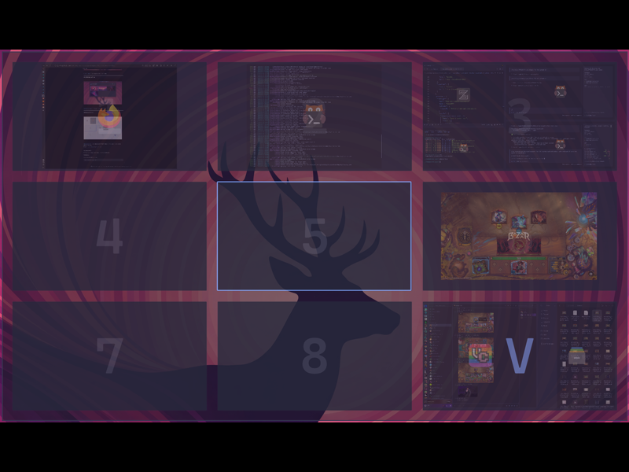

# Workspace Overview

A visual workspace overview plugin for **Noctalia Shell + Hyprland**, ported from [quickshell-overview](https://github.com/Shanu-Kumawat/quickshell-overview) by [Shanu-Kumawat](https://github.com/Shanu-Kumawat) (originally extracted from [illogical-impulse](https://github.com/end-4/dots-hyprland) by end-4).

This plugin brings the full quickshell-overview experience into Noctalia Shell as a first-class plugin, with native theming, settings integration, and an optional bar widget.

## Features

- **Live window previews** — real-time screencopy thumbnails of every window
- **Workspace grid** — configurable N×M grid layout (default 2×5 = 10 workspaces)
- **Drag and drop** — move windows between workspaces by dragging previews
- **Keyboard navigation** — arrow keys, vim-style hjkl, number keys for quick switching
- **Click interactions** — left-click to focus a window, middle-click to close it
- **Smart row hiding** — optionally collapse empty workspace rows
- **Hover tooltips** — window title, class name, and XWayland indicator
- **Active workspace indicator** — animated border highlights your current workspace
- **Bar widget** — optional pill-style toggle button in the Noctalia bar
- **Native theming** — automatically uses your Noctalia Material You color scheme
- **Settings UI** — configure everything through the Noctalia plugin settings panel

## Requirements

- [Hyprland](https://hyprland.org/) compositor
- [Quickshell](https://quickshell.outfoxxed.me/) with Wayland & Hyprland modules
- [Noctalia Shell](https://github.com/anthropics/noctalia-shell)

## Setup

### 1. Install the plugin

Copy or symlink the `workspace-overview` folder into your Noctalia plugins directory:

```bash
# Symlink (for development)
ln -s /path/to/workspace-overview ~/.config/noctalia/plugins/workspace-overview

# Or copy (for production)
cp -r workspace-overview ~/.config/noctalia/plugins/
```

### 2. Add a keybind

Add a toggle keybind to your Hyprland config (`~/.config/hypr/hyprland.conf`):

```
bind = Super, TAB, exec, qs ipc call plugin:workspace-overview toggle
# Optional: Mouse bind (middle click)
bind = SUPER, mouse:274, exec, qs ipc call plugin:workspace-overview toggle
```

### 3. Reload

```bash
hyprctl reload
```

The overview should now appear when you press **Super+Tab**.

## Usage

### Mouse

| Action | Effect |
|--------|--------|
| **Left-click** a window | Focus that window and close overview |
| **Middle-click** a window | Close that window |
| **Left-click** an empty workspace | Switch to that workspace |
| **Drag** a window to another workspace | Move the window silently |

### Keyboard

| Key | Effect |
|-----|--------|
| **Escape** | Close the overview |
| **Enter / Return** | Switch to the highlighted workspace |
| **Arrow keys** | Navigate between workspaces |
| **h / j / k / l** | Navigate (vim-style) |
| **1–9** | Jump directly to workspace by number |

### Bar Widget

If you add the `workspace-overview` widget to your bar configuration, it provides:

- **Left-click**: Toggle the overview
- **Right-click**: Open context menu with settings access

## IPC Commands

Control the overview programmatically from scripts or keybinds:

```bash
# Toggle overview on/off
qs ipc call plugin:workspace-overview toggle

# Open the overview
qs ipc call plugin:workspace-overview open

# Close the overview
qs ipc call plugin:workspace-overview close
```

## Settings

All settings are configurable through the Noctalia plugin settings UI (right-click the bar widget → Settings, or open from the shell settings panel).

| Setting | Default | Description |
|---------|---------|-------------|
| **Rows** | `2` | Number of workspace rows (1–5) |
| **Columns** | `5` | Number of workspace columns (1–10) |
| **Scale** | `0.16` | Overview scale factor (0.08–0.30, smaller = more compact) |
| **Hide empty rows** | `true` | Collapse rows that have no windows |
| **Top margin** | `100` | Distance from the top of the screen in pixels |

## Credits

This plugin is a port of [quickshell-overview](https://github.com/Shanu-Kumawat/quickshell-overview) by **Shanu-Kumawat**, which was originally extracted from [illogical-impulse (dots-hyprland)](https://github.com/end-4/dots-hyprland) by **end-4**. Adapted for the Noctalia Shell plugin architecture with native theming and settings integration.
